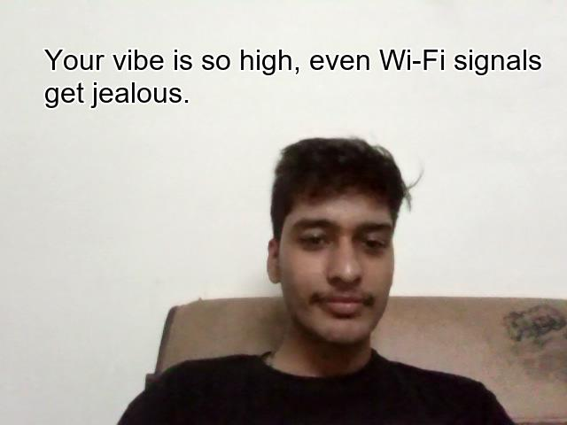

😎 Roast Generator with Smile Detection 😂

A fun Python app that detects your mood in real-time and delivers a roast based on your facial expression! Smile and get a happy roast, or stay serious and get a sad roast—all overlaid on your photo and read aloud. Perfect for pranking friends or just having a laugh at yourself!
_____________________________________________________________________________________________________________________________________________________________________________________________________________________
🚀 Features

😁 Real-time mood detection using your facial expression.

🤪 Mood-based roast generator with funny, sassy lines.

🖼️ Image output with roast text overlaid.

🗣️ Text-to-Speech reads the roast aloud.

⏱️ Auto camera timeout after a few seconds or by pressing q.
_____________________________________________________________________________________________________________________________________________________________________________________________________________________

🎬 How It Works

Detects your face using OpenCV Haar cascades.

Detects a smile to classify your mood as “happy” or “sad.”

Generates a random roast from a predefined list.

Overlays the roast on your captured image using PIL.

Speaks the roast aloud using pyttsx3.
_____________________________________________________________________________________________________________________________________________________________________________________________________________________

⚡ Installation
git clone <https://github.com/Vanshh1sharma/Roast_Generator.git>
cd roast-generator
pip install opencv-python pillow pyttsx3
_____________________________________________________________________________________________________________________________________________________________________________________________________________________
Note: Make sure the Haar cascade XML files (haarcascade_frontalface_alt.xml and haarcascade_smile.xml) are in the project folder or update the paths in the code.
_____________________________________________________________________________________________________________________________________________________________________________________________________________________

🖥️ Usage
python roast_generator.py

Smile → “Happy” roast appears.

No smile → “Sad” roast appears.

Your roast image is saved automatically with a timestamp.

Roast is read aloud via Text-to-Speech.
_____________________________________________________________________________________________________________________________________________________________________________________________________________________

🎨 Customization

Add more roasts in the moods dictionary for more variety.

Adjust smile detection sensitivity:

smiles = smile_cascade.detectMultiScale(roi_gray_mouth, scaleFactor=1.3, minNeighbors=8)

Change font, color, or position of overlay text in PIL.
_____________________________________________________________________________________________________________________________________________________________________________________________________________________

🔮 Future Improvements

Replace Haar cascades with Mediapipe or deep learning models for more accurate smile detection.

Add additional mood categories beyond “happy” and “sad.”

Enable social sharing, leaderboard, or live streaming features.
_____________________________________________________________________________________________________________________________________________________________________________________________________________________

📸 Demo

_____________________________________________________________________________________________________________________________________________________________________________________________________________________

📝 License

MIT License – feel free to remix, reuse, and roast responsibly.
